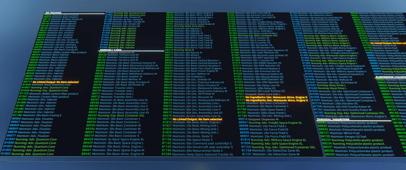

# Wolfe Labs Industry Monitor

A fast and simple factory monitor script, for all your industrialist needs!

Inspired on the idea of [BartaRS's Factory Monitoring Expanded](https://github.com/BartasRS/Factory-Monitoring-Expanded) script.

## Installation

Download a pre-compiler JSON file from the "Releases" tab, copy its contents and install it by right-clicking a Programming Board, selecting "Advanced" and then "Paste Lua configuration from clipboard".

After installing into a Programming Board, link it to your factory's Core Unit and then to each of your screens, from first to last.

## Usage

After activating the Programming Board, you will see some information on your Lua chat:
- The current range (first and last industry codes) that are currently visible;
- List of industry with missing schematics;
- List of industry with missing inputs or outputs;
- List of industry that might be "stuck" after a game update;

You will also be presented with a list of commands that can be typed into the Lua chat.

After this brief status check, the script starts to fetch and update status automatically.

You will notice that your screens will be updated with a list of codes on the left and statuses on the right. The codes *are not* related to your industry's element ids, those are internal codes used to track each industry unit.

The code's color indicates the industry unit's tier (Basic, Uncommon, Advanced or Rare) and the status color is related to each status, with dimmer colors being used for running/maintaining/pending statuses which usually mean everything's fine, while bright colors being used for anything that needs your attention, such as warnings, errors or single-batches that are completed.

You can locate any industry unit in your factory by taking the code displayed on the screens and typing the following command `find 1234`, where *1234* is the code of your industry. Your destination will be set to the machine, along with some extra information about it being displayed in the Lua chat.

You can also view a list with all detected errors on your construct with the command `error_check`.

## Configuration

You can customize what information gets displayed by right-clicking the Programming Board, going to "Advanced" and then selecting "Edit Lua parameters", from there, you should be able to select which types and tiers of industry are going to be displayed, along with a few extra options:

- **Show Industry Name** will show the custom element names for any elements you have renamed;
- **Refresh Interval** allows you to set how many seconds between each screen refresh;
- **Range Start** sets where the displayed range of industry should start, in case you want to set-up a wall with more than a single row of screens;

## Support & Special Thanks

If you find this script useful and want to support its development, feel free to make a donation to the **Wolfe Labs** in-game organization, any amounts are much appreciated!

Special thanks to the following players and organizations, for testing the script on their factories, supporting the development, and giving out feedback on how it could be improved:

- Kolden
- Fridaywitch/Kosmos
- Tobitege